### 1. Singal :  
* Analog Singal : Continusous-time Signals  
  * Sinusoids
* Digital Singal : Discrete-time Signals
### 2.Audacity :  
* Audio processing tool
* Free, Open Source, Cross-Platform
### 3.Wave :  
sinusoid, square, sawtooth, triangle, harmonic, beat, fadeout, chirp
### 4.Noise :
Uniform Noise, Gaussian Noise, Brownian Noise, Impulse Noise
### 5.Signal-to-Noise Ratio, SNR(Unit: dB)  
### 6.DSP : y[n]=T{x[n]}, T{．} is Transform  
* Static System(Memoryless System) vs Dynamic System(Memory System)  
* Linear System vs Nonlinear System  
* Time-Invariant System vs Time-Varying System  
* Causal System vs Non-Causal System  
* Stable System vs Non-Stable System  
* Sampling Rate Conversion  
  * Downsampling-Decimation- y[n]=x[2n]  
    *Decimation, Average  
  * Upsampling-Interpolation- y[n]=x[n/2]  
    *Zero-Order Hold, Linear Interpolation, Polynomial Interpolation, Spline Interpolation
  * Resampling
### 7.Convolution :  
  * Continusous-time : y(t)=x(t)* h(t), h(t) is system response  
  * NContinusous-time : y[n]=x[n]* h[n], h[n] is impulse response  
    *if {x(n)},n=1,2,3...N & {h(n)},n=1,2,3...M, then length of convolution result = M+N-1  
    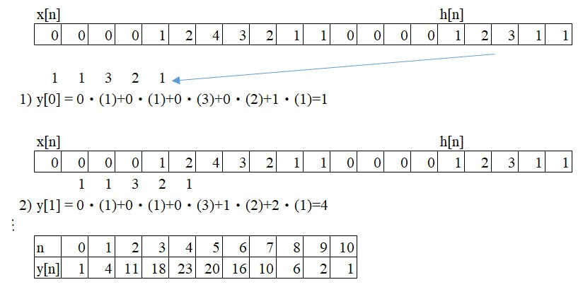
  * Linear Time-invariant Systems : Cascade connection & Parallel connection  
``` bash
    *Cascade connection : y[n]=h2[n]*(h1[n]*x[n])=(h2[n]*h1[n])*x[n]=(h1[n]*h2[n])*x[n]  
    *Parallel connection : y[n]=h1[n]*x[n])+h2[n]*x[n])=(h1[n]+h2[n])*x[n])  
``` 
  * Convolution is core of DSP, basic application is "Filtering".So, Impulse response also is named Filter.  
    *Average Filters & Gaussian Filters
### 8.Correlation 
  * Cross-Correlation
``` bash
    *Continusous-time : y(t)=x(t) ★ h(t)  
    *NContinusous-time : y[n]=x[n] ★ h[n]  
``` 
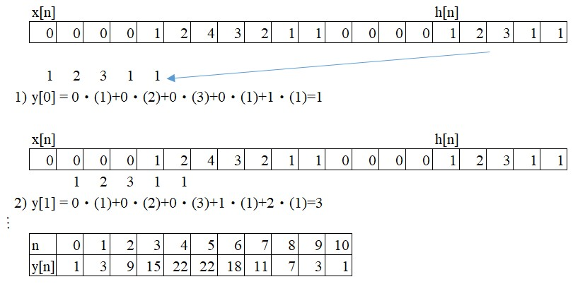
  * Autocorrelation : y[n]=x[n] ★ x[n]
### 9.Fourier Series
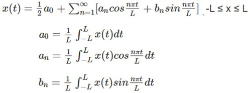  
  * Gibbs Phenomenon
### 10.Fourier Transforms
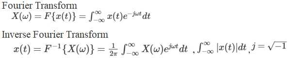
  * x(t) <-> X(ω)  
  * L'Hopital's Rule  
  * Fourier Transform Shifting Theorems  
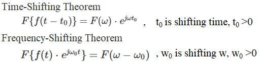
  * Convolution Theorem  
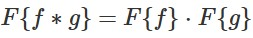
  * Gaussian Fourier Transform  
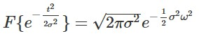
### 11.Discrete-time Fourier Transforms, DTFT  
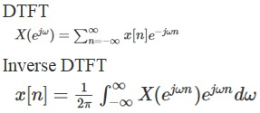
### 12.Discrete Fourier Transforms, DFT  
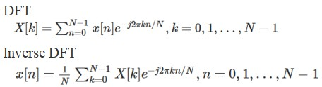
### 13.Z Transform  
$X(z) = Z\{x[n]\}=\sum_{n=-∞}^∞ x[n]z^{-n}$  
  * Transform Function : $y[n]=h[n] * x[n] => Y(x)=H(z)‧X(z)$  
### 14.Inverse Z Transform  
  * Long Division Method  
  * Partial Fraction Expansion Method  
  * Residue Method  
### 15.Finite Impulse Response, FIR Filter  
Definition : $y(n) =\sum_{k=∞}^M b_kx[n-k]$  
Transition function : $H(z) =b_0+b_1z^{-1}+...+b_Mz^{-M}$  
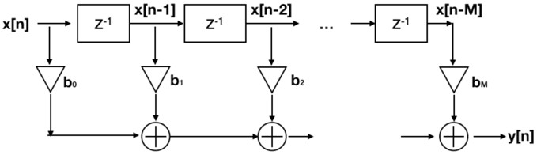
  * Moving Average Filter  
  * Analysis of Stock Trends  
  * Nulling Filter(Notch Filter)  
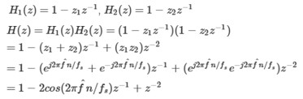
### 16.Infinite Impulse Response, IIR Filter  
Definition : $y(n) =\sum_{k=1}^N a_ky[n-k]+\sum_{k=0}^M b_kx[n-k] => y[n]=a_1y[n-1]-a_2y[n-2]-...-a_Ny[n-N]+b_0+b_1x[n-1]...+b_Mx[n-M]$  
Transition function : $H(z) = \frac{Y(z)}{X(z)}\quad = \frac{b_0+b_1z^{-1}+...+b_Mz^{-M}}{a_0+a_1z^{-1}+...+a_Nz^{-N}} \quad$  
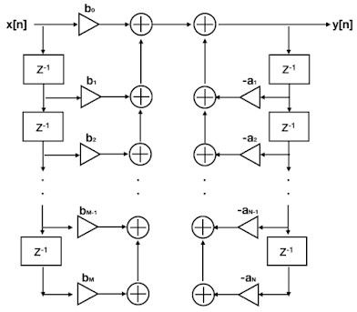
  * Impulse response
  * Unit response
  * App : Echo system
### 17.Spectrum Analysis
  * Fourier Spectrum $X[k] =\sum_{n=0}^{N-1} x[n]e^{-j2πkn/N}, k = 0,1,....,N-1$  
  * Power $E =\sum_{n=-∞}^{∞} x^{2}[n]$  
  * Parseval’s Theorem
  * Energy Spectral Density
  * Power Spectral Density (PSD) : Periodogram, Welch's method
### 18.Frequency Response
  * DSP's Frequency Response is $H[e^{jω}] =\sum_{n=-∞}^{∞} h[n]e^{-jωn}$  
  * Lowpass Filter, Highpass Filter, Bandpass Filter, Bandstop Filter, Notch Filter, Comb Filter, All-pass Filter  
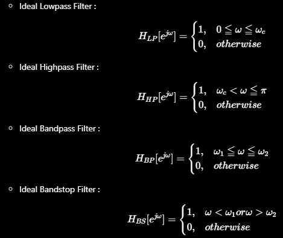  
  * Average Filter : $h[n] = \frac{{1,1,1,1...,1}}{M}\quad, n=0,1,2...,M-1$  
  * Gaussian Filter : $g[n] = e^{-n^{2}/2σ^{2}}$  
  * FIR Lowpass Filter : $H_0(z) = \frac{1+z^{-1}}{2}\quad$  
  * FIR Highpass Filter : $H_l(z) = \frac{1-z^{-1}}{2}\quad$  
  * IIR Lowpass Filter : $H_0(z) = \frac{1-α}{2}\quad(\frac{1+z^{-1}}{1-αz^{-1}}\quad)$  
  * IIR Highpass Filter : $H_l(z) = \frac{1+α}{2}\quad(\frac{1-z^{-1}}{1-αz^{-1}}\quad)$  
  * IIR Bandpass Filter : $H_l(z) = \frac{1-α}{2}\quad(\frac{1-z^{-2}}{1-β(1+α)z^{-1}+αz^{-2}}\quad)$  
  * Comb Lowpass Filter : $H_{CLP}(z) = \frac{1+z^{-M}}{2}\quad$  
  * Comb Highpass Filter : $H_{CLP}(z) = \frac{1-z^{-M}}{2}\quad$  
### 19.Digital Signal Processing in Frequency Domain
  * x[n] ->Fourier Transforms ->Filter-> Inverse Fourier Transforms  
### 20.Filter design
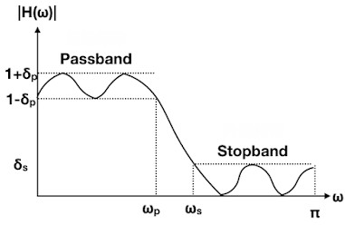
  * Design Filter spec -> Select filter type -> Find the conversion function -> Implementing the filter  
  * Window Function  
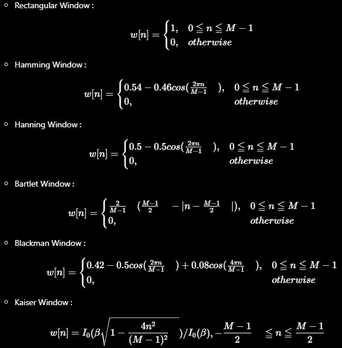  
  * FIR design
    * Lowpass, Highpass, Bandpass, Bandstop
  * IIR design
    * Butterworth Filter, Chebyshev Type I Filter, Chebyshev Type II Filter, Elliptic Filter
    * Select filter type -> Design Filter spec -> Select Sampling Frequency -> Filter parameter -> Transfer Function -> Frequency Response
### 21.Time-Frequency Analysis
  * STFT, Discrete STFT  
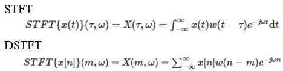
  * Spectrogram  $|x(m, ω)|^2$
### 22.DSP Application
  * Digital music synthesis  
  * Digital speech synthesis  
  * Digital speech recognition  
  
  
**** notice: "return R[int(R.size/2):]" ==> ":" is important